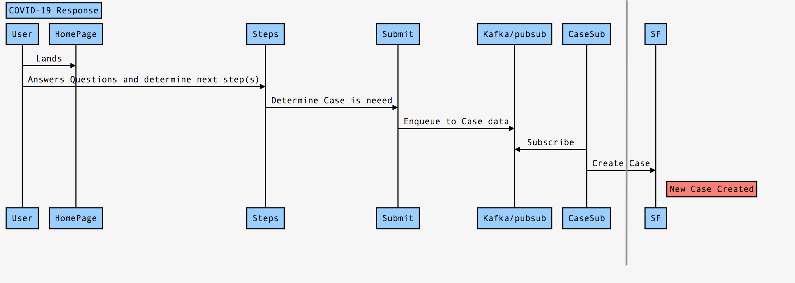
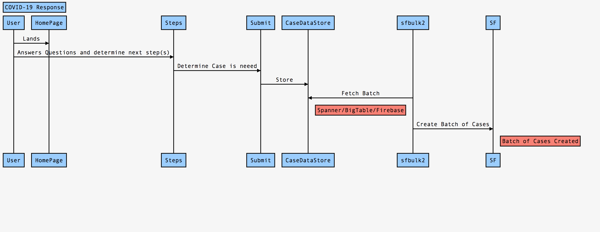

## Sample code for GCP pubsub

### Sequence diagram

- Option-1



```js

const fetch = require("node-fetch");
// code to create case
async function createCase(subject, at, priority) {
    const sobj = 'Case';
    // TODO: change the url as required
    const url = `https://mohansun-fsc-21.my.salesforce.com/services/data/v46.0/sobjects/${sobj}`;

    // TODO: design the fields needed for the case creation and get it a part of the message data
    const postbody = { "Subject": `${subject}`, "Priority": `${priority}`} ;

    const params = {
        method: "POST",
        mode: "cors",
        headers: {"Content-Type":"application/json", "Authorization": `Bearer ${at}` },
        body: JSON.stringify(postbody)
    };
    try { await fetch(url, params)
    }
    catch (err) {
      console.log('Fetch ERROR!' + err);
    }
}


 const subscriptionName = 'CV19_CASE';
 const timeout = 60;

// Imports the Google Cloud client library
const {PubSub} = require('@google-cloud/pubsub');

// Creates a client; cache this for further use
const pubSubClient = new PubSub();

function listenForMessages() {
  // References an existing subscription
  const subscription = pubSubClient.subscription(subscriptionName);

  // Create an event handler to handle messages
  let messageCount = 0;
  const messageHandler = message => {
    console.log(`Received message ${message.id}:`);
    console.log(`\tData: ${message.data}`);
    console.log(`\tAttributes: ${message.attributes}`);
    messageCount += 1;

    // CREATE Case here
     const cst = await createCase(message.data.subject, message.data.at, message.data.priority);

    // "Ack" (acknowledge receipt of) the message
    message.ack(message.data.);
  };

  // Listen for new messages until timeout is hit
  subscription.on('message', messageHandler);

  setTimeout(() => {
    subscription.removeListener('message', messageHandler);
    console.log(`${messageCount} message(s) received.`);
  }, timeout * 1000);
}

listenForMessages()
```
- Option-2


### Slides

 [SALESFORCE BULK API 2.0 NPM](https://mohan-chinnappan-n2.github.io/2020/bulkapi2/bulkapi2.html#0)


```js
// filename:index.js
// test file for sfbulk2js 
// author: mohan chinnappan (mar-18-2020) 

const sfb2 = require('sfbulk2js'); // the npm package we just installed
const  fs = require('fs');
const process = require('process');

// read access-token from the env
const AT = process.env.AT;

const cji = {
     instanceUrl: 'https://mohansun-fsc-21.my.salesforce.com',
     apiVersion: 'v46.0',
     accessToken: `${AT}`,
     contentType: 'CSV',
     lineEnding: 'LF'
};

const waitTimeMs = 5000;

function sleep(ms) {
  console.log('WAITING');
  return new Promise(resolve => setTimeout(resolve, ms));
}

async function dataload(datafile) {
 try {

     console.log(`=== CREATE JOB === `);
     const job = await sfb2.createJob(cji.instanceUrl, cji.apiVersion, cji.accessToken, 'insert', 'Case', cji.contentType,  cji.lineEnding );
     console.log(job);
     console.log(`jobId: ${job.id}`);

     console.log(`=== JOB STATUS === `);
     let jobStatus = await sfb2.getJobStatus(cji.instanceUrl, cji.apiVersion, cji.accessToken, 'ingest', job.id );
     console.log(`=== JOB STATUS for job: ${job.id} ===`);
     console.log(jobStatus);


     console.log(`=== PUT DATA === `);

     const fdata =  fs.readFileSync(datafile, 'utf8');
     const putDataStatus  = await sfb2.putData(cji.instanceUrl, cji.accessToken, job.contentUrl, fdata );

     console.log(`=== JOB STATUS === `);
     jobStatus = await sfb2.getJobStatus(cji.instanceUrl, cji.apiVersion, cji.accessToken, 'ingest', job.id );
     console.log(`=== JOB STATUS for job: ${job.id} ===`);
     console.log(jobStatus);

     console.log(`=== PATCH STATAE === `);
     const patchDataStatus  = await sfb2.patchState(cji.instanceUrl, cji.apiVersion, cji.accessToken,  job.id, 'UploadComplete' );
     console.log(patchDataStatus);

     console.log(`=== JOB STATUS === `);
     jobStatus = await sfb2.getJobStatus(cji.instanceUrl, cji.apiVersion, cji.accessToken, 'ingest', job.id );
     console.log(`=== JOB STATUS for job: ${job.id} ===`);
     console.log(jobStatus);

     while (jobStatus.state === 'InProgress') { // wait for it 
        await sleep(waitTimeMs);
        jobStatus = await sfb2.getJobStatus(cji.instanceUrl, cji.apiVersion, cji.accessToken, 'ingest', job.id );
        console.log(jobStatus);
     }

     console.log(`=== JOB Failure STATUS === `);
     jobStatus = await sfb2.getJobFailureStatus(cji.instanceUrl, cji.apiVersion, cji.accessToken,  job.id );
     console.log(`=== JOB Failure STATUS for job: ${job.id} ===`);
     console.log(jobStatus);

     console.log(`=== JOB getUnprocessedRecords STATUS === `);
     jobStatus = await sfb2.getUnprocessedRecords(cji.instanceUrl, cji.apiVersion, cji.accessToken,  job.id );
     console.log(`=== JOB getUnprocessedRecords STATUS for job: ${job.id} ===`);
     console.log(jobStatus);


} catch (err) {
     console.log(`ERROR in dataload : ${err}`);
   }

}

// here we run it
dataload('input.csv');


```
