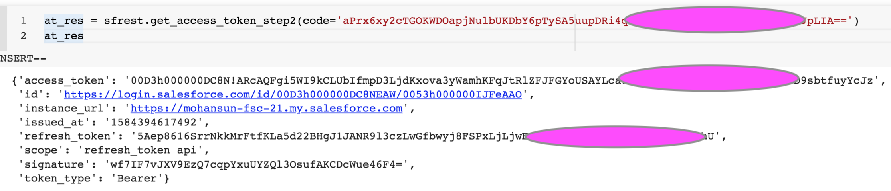

## How to get the refresh token?

### Get the Access token


```
POST /services/oauth2/token HTTP/1.1
Host: login.salesforce.com/ 
grant_type=refresh_token&
client_id=3MVG9lKcPoNINVBIPJjdw1J9LLM82HnFVVX19KY1uA5mu0QqEWhqKpoW3svG3XHrXDiCQjK1mdgAvhCscA9GE&client_secret=1955279925675241571&
refresh_token=your token here 

```

### References
- [OAuth 2.0 Refresh Token Flow for Renewed Sessions](https://help.salesforce.com/articleView?id=remoteaccess_oauth_refresh_token_flow.htm&type=5)
